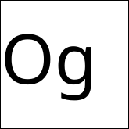

# Oganesson: Python workflows for materials research

Oganesson connects atomistic structure preparation, structural analysis and machine learning in one Python interface. Use it to build candidate materials, convert structures into numerical descriptors, and explore structures and dynamics with machine-learned interatomic potentials.

The central object, `OgStructure`, wraps a pymatgen `Structure` and accepts ASE `Atoms` or a structure file. Basic Python and familiarity with crystal structures are enough to start.

## Choose a workflow

| Research task | Tools | Output |
| --- | --- | --- |
| Prepare alloys, defects and surfaces | `substitutions_random()`, `add_interstitial()`, `add_atom_to_surface()` | Candidate geometries for relaxation |
| Compare structure and diffraction | `get_rdf()`, `xrd()` | Radial distribution functions and simulated XRD patterns |
| Build inputs for property models | `BACD`, `SymmetryFunctions`, DScribe wrappers | Numerical feature vectors |
| Relax structures or explore dynamics | `relax()`, `simulate()` | Potential-dependent energies, structures and trajectories |
| Prepare ion-migration calculations | `generate_neb_images()`, `generate_neb()` | Initial geometries for nudged elastic band (NEB) calculations |
| Search at fixed composition | `GA` | Candidates ranked using relaxed total energies |

Follow the [materials science tutorial](tutorial.ipynb) from structure preparation and analysis to descriptors, then optional simulation workflows. It explains inputs, output files and scientific interpretation.

## Installation

Install into an isolated Python environment:

```sh
python -m pip install oganesson
```

For the tutorial, download or clone this repository and run these commands from its root directory:

```sh
python -m pip install -e .
python -m pip install jupyterlab matplotlib
python -m jupyter lab tutorial.ipynb
```

Select a kernel using the same Python environment. Introductory examples build crystals with ASE or use the bundled MoS2 structure; no database account is needed.

The dependencies declared in [setup.py](setup.py) include ASE, pymatgen, NumPy, pandas, DIEP, bsym and diffusivity. `OgStructure` imports DIEP even for geometry-only work. Graph-backend requirements depend on the installed DIEP version and potential; the repository does not pin a complete environment.

| Optional workflow | Additional installation |
| --- | --- |
| DScribe descriptors | `python -m pip install dscribe` |
| ROSA descriptors | GPAW and its required datasets |
| Explicit M3GNet potential | `python -m pip install "oganesson[matgl]"` (use `".[matgl]"` for a local checkout) |
| Ripple geometry | `python -m pip install sympy` |

## First example: describe a crystal

Build an ideal face-centred cubic Cu primitive cell and calculate a BACD feature vector:

```python
import numpy as np
from ase.build import bulk
from oganesson.ogstructure import OgStructure
from oganesson.descriptors import BACD

copper = OgStructure(bulk("Cu", "fcc", a=3.6))  # lattice parameter in angstrom
features = np.asarray(BACD(copper).describe(), dtype=float)
print("Composition:", copper.structure.composition.reduced_formula)
print("Volume (angstrom^3):", copper.structure.volume)
print("Number of features:", features.size)
```

BACD combines elemental-property statistics, structural quantities and a space-group encoding. The vector is an input to a model, not a prediction of the crystal's measured properties. Supervised learning also requires reference labels and an independent evaluation dataset.

Load your own file with `OgStructure(file_name="path/to/structure.cif")`. Access pymatgen through `.structure`, or convert to ASE with `.to_ase()`.

## Interpreting calculation results

The current default for relaxation, molecular dynamics and genetic search is `model="diep"`, loading the bundled potential. `model="m3gnet"` explicitly selects the MatGL M3GNet model. Other model strings are passed to the DIEP loader. Record the potential and software versions with your calculation settings.

- Surface and defect routines generate starting configurations. Relax and compare candidates before assigning preferred sites or defect energies.
- NEB helpers prepare geometries; they do not calculate a converged migration barrier. The tutorial distinguishes interpolation from the automatic helper, which independently relaxes images.
- `simulate()` runs molecular dynamics with a machine-learned potential. Validate the potential for the chemistry and conditions of interest before interpreting predictions.
- A genetic search finds low-energy candidates within the chosen composition and search settings. It does not establish a global minimum or stability against competing phases.

Oganesson is under active development. The [tutorial](tutorial.ipynb) identifies implementation-specific behaviour and marks expensive or data-dependent sections as optional.

## Project information

- [Source code](oganesson/ogstructure.py) and [changes](CHANGELOG.md)
- [Contribution guide](CONTRIBUTING.rst)
- [MIT licence](LICENSE)

When reporting results, cite the descriptors, potentials, software and reference data actually used. The original descriptor paper is identified by DOI **10.1186/s13321-022-00658-9**.
